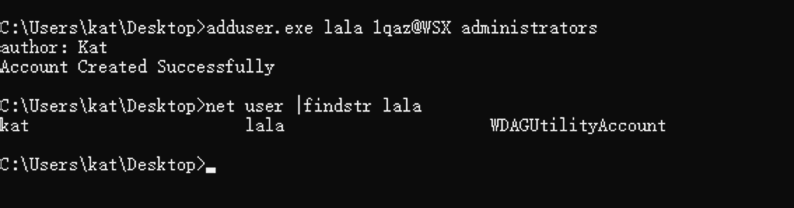
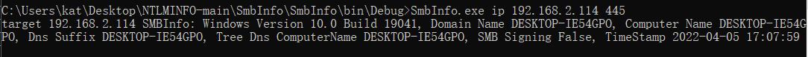
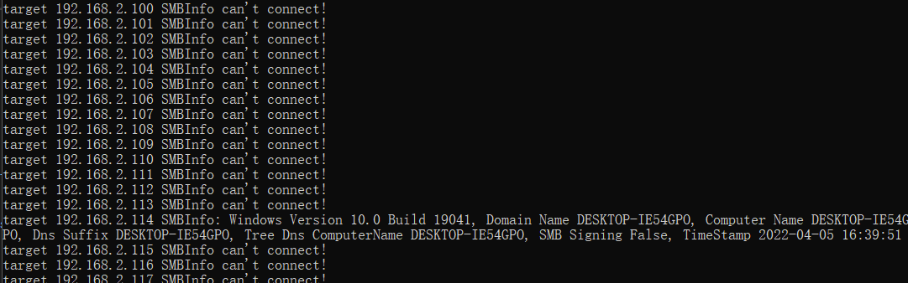
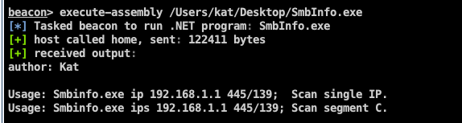

# SharpTools
CSharp后渗透工具集

### 0x01 addUser
bypass AV添加用户  
```
Usage：adduser.exe <username> <password> <group>
```


  


### 0x02 NtlmInfo

利于NTLM type2 阶段返回系统信息的特性进行信息收集，收集主机是否在域内，主机名称等信息；包括利用Smb、Wmi、WmiRM等协议。
以Smbinfo为例：  

```
Usage: Smbinfo.exe ip 192.168.1.1 445/139;  Scan single IP.
Usage: Smbinfo.exe ips 192.168.1.1 445/139; Scan segment C.
```

扫描单个IP


扫描C段


CS内存加载



